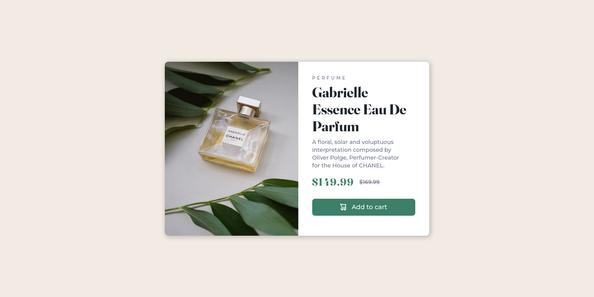

# Frontend Mentor - Product preview card component

This is the [Product preview card component challenge on Frontend Mentor](https://www.frontendmentor.io/challenges/product-preview-card-component-GO7UmttRfa).

## Table of contents

- [Overview](#overview)
  - [The challenge](#the-challenge)
  - [Screenshot](#screenshot)
  - [Links](#links)
- [My process](#my-process)
  - [Built with](#built-with)
- [Author](#author)

## Overview

### The challenge

Users should be able to:

- View the optimal layout for the site depending on their device's screen size
- See hover states for all interactive elements on the page

### Screenshot

#### Desktop

#### mobile

### Links

- Solution URL: [This is the solution as seen from Frontend Mentor.](https://www.frontendmentor.io/solutions/accessibility-flexbox-responsive-transitions-R6pFRoFkc8)
- Live Site URL: [Live solution](https://boudgnosis.github.io/Product-preview-card-component/)

## My process

### Built with

- Semantic HTML5 markup
- CSS custom properties
- Flexbox
- Transitions
- Accessibility
- Mobile-first workflow
- Media queries
- Pseudo-classes

## Author

- Codepen - [@boudgnosis](https://codepen.io/boudgnosis)
- Frontend Mentor - [@boudgnosis](https://www.frontendmentor.io/profile/boudgnosis)
- Twitter - [@juan_ariasd](https://twitter.com/juan_ariasd)
- Dev - [@juan_duque](https://dev.to/juan_duque)
- Linkedink - [juan pablo arias duque](https://www.linkedin.com/in/jpariasduque/)
